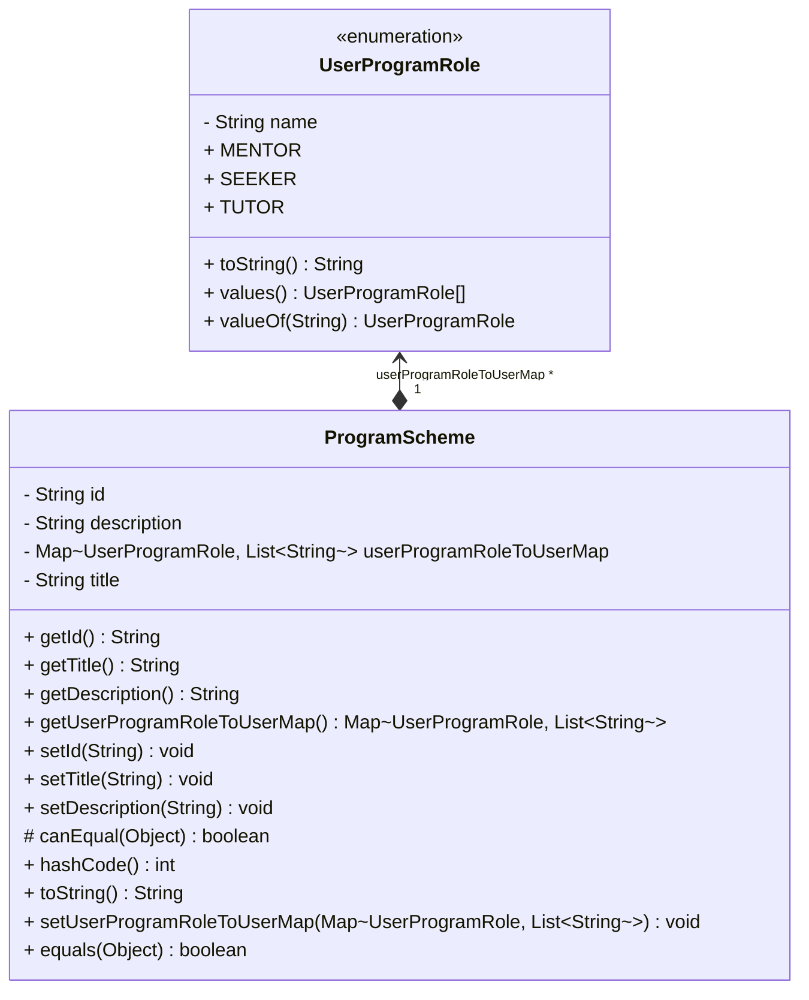

```mermaid
classDiagram
direction BT
class ProgramScheme {
  - String id
  - String description
  - Map~UserProgramRole, List~String~~ userProgramRoleToUserMap
  - String title
  + getId() String
  + getTitle() String
  + getDescription() String
  + getUserProgramRoleToUserMap() Map~UserProgramRole, List~String~~
  + setId(String) void
  + setTitle(String) void
  + setDescription(String) void
  # canEqual(Object) boolean
  + hashCode() int
  + toString() String
  + setUserProgramRoleToUserMap(Map~UserProgramRole, List~String~~) void
  + equals(Object) boolean
}
class UserProgramRole {
<<enumeration>>
  - String name
  +  MENTOR
  +  SEEKER
  +  TUTOR
  + toString() String
  + values() UserProgramRole[]
  + valueOf(String) UserProgramRole
}

ProgramScheme "1" *--> "userProgramRoleToUserMap *" UserProgramRole 

```